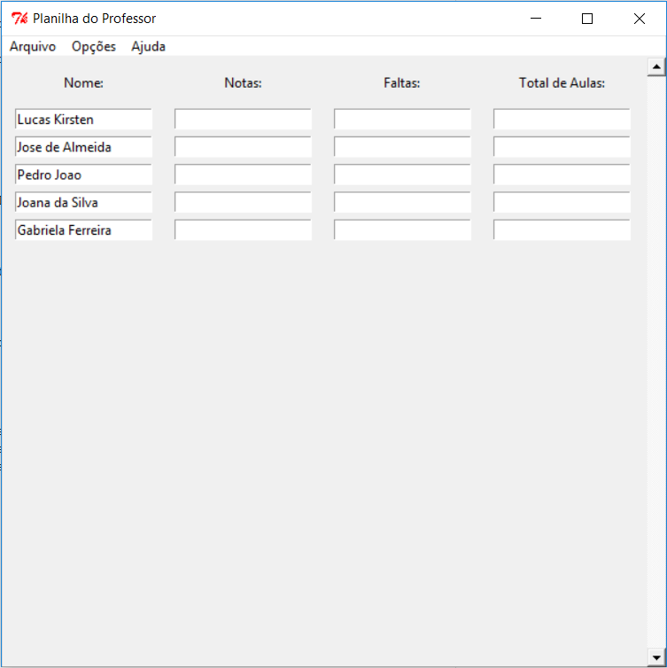

# Planilha do Professor (Teachers-Spreadsheet)
Programa simples desenvolvido em Tkinter para a validação das notas e presença dos alunos de uma turma.

>Simple program to evaluate the score and presence of students, developed in Tkinter.

## Pré-requisitos (Prerequisites)

- Python 2.7

## Guia para o usuário (User guide)

O programa pode ser aberto clicando duas vezes sobre o arquivo **Planilha_professor.py**. A seguinte janela será aberta:

Para criar uma nova turma, vá em **Arquivo**->**Nova Turma**. A seguinte janela será aberta:

Dê um nome a turma e escreva o nome dos alunos das mesma (evite usar acentos), separando cada novo nome por um *<ENTER>* como mostrado abaixo.

Clique em **Armazenar** para salvar a turma. Escolha o diretório de sua preferência e o nome do arquivo a ser salvo. Você pode editar uma turma já criada indo em **Arquivo**->**Editar Turma**. Para manipular as notas e presença dos alunos, vá em **Arquivo**->**Carregar Turma** e selecione o arquivo com a turma que você quer manipular os dados. A seguinte tela irá se apresentar:

Em **Opções** você pode selecionar se a nota final do aluno será a média das notas colocadas, ou vai ser dada em relação a operação matemática colocada para a nota do aluno escolhendo entre **Fazer Média** ou **Calcular**, respectivamente. Selecionando a opção **Definir Aulas** o número *Total de Aulas* será o mesmo para todos os alunos, bastando dizer o total de aulas para o primeiro aluno. Você pode também determinar se será apresentado a percentagem de presença ou ausência do aluno escolhendo entre **Presença** e **Ausência**, respectivamente. Abaixo é mostrado o exemplo de preenchimento com a opção **Fazer Média** e **Definir Aulas**.

E abaixo é mostrado o exemplo de preenchimento com a opção **Calcular** e sem **Definir Aulas**.

Você pode salvar os dados preenchidos indo em **Arquivo**->**Salvar**. Para recuperar os dados salvos, vá em **Arquivo**->**Carregar Turma**, selecione a pasta com o nome da turma (essa pasta é criada no mesmo dirétorio que está o programa) e selecione o arquivo com o nome da turma e final *_dados*. Para fazer todos os cálculos em cima dos dados fornecidos vá em **Arquivo**->**Gerar Planilha**. A planilha gerada estará numa pasta criada no mesmo diretório em que está o programa e com o nome da turma. Entre nessa pasta e abre o arquivo com inicial *Planilha*. O arquivo aberto será como o do exemplo abaixo.

